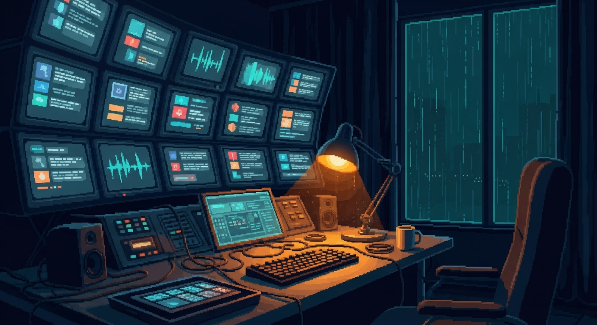

<p align="center">
  <a href="https://pablo-oss.vercel.app/content-pipeline">
    
  </a>
</p>

<h1 align="center">Content Pipeline</h1>

<p align="center"><em>A local-first desktop app and web server for running your short-form video and text-post pipeline end to end.</em></p>

<p align="center">
  
  
  
  
  
  
</p>

<p align="center">
  <a href="https://opensource.org/licenses/MIT"></a>
  
  
  <a href="https://pablomanjarres.com/portfolio/projects/content-pipeline"></a>
  <a href="https://pablo-oss.vercel.app/content-pipeline"></a>
</p>

<p align="center">
  
</p>

Content Pipeline tracks every piece of content from a raw idea to a posted link. You plan the week, drop in clips from your phone, move videos through a status board (idea, scripted, filming, editing, ready, scheduled, posted), draft text posts for LinkedIn, X, and Reddit, and keep a queue of AI-drafted replies for review before anything goes out.

The core runs on your machine. Videos, posts, ideas, and weekly plans live in plain JSON files on disk, and media stays in a folder you point at. Nothing is required to be in the cloud. Optional server modules connect to outside services (Algolia search, Pushover alerts, a Supabase table for the reply radar, an Obsidian vault sync) only when you set their environment variables.

## Highlights

- **Video pipeline board.** Every video moves through seven statuses with per-platform targets for LinkedIn, Instagram Reels, Threads, TikTok, and YouTube Shorts, each carrying its own caption, hashtags, posted flag, and URL.
- **Text posts for LinkedIn, X, and Reddit.** Draft, mark written, schedule, and record the posted link. A post can be tied to the video it promotes.
- **Idea backlog.** Capture ideas with a hook and category, then convert one into a video with a single call.
- **Media browser.** Read raw clips straight from a folder on disk, grouped by ISO week and upload day. Video streams with range-request support so scrubbing works.
- **Weekly planner.** Plan what you build each day, note what actually shipped, and attach media to the day.
- **Outbound review queue.** AI-drafted reply and DM candidates land in an Outbound surface with quality scores and tiers, so you review before sending. Sent items keep an audit trail.
- **Watchlist radar.** A tiered list of handles the radar polls for new posts worth replying to.
- **Content engine.** Register a git repo, pull the commit log between two dates, and turn shipped work into draft posts and scripts.
- **Runs on your phone.** Add it to an iPhone or iPad home screen as a PWA, and reach it over Tailscale.
- **Ships as a Mac app.** One command builds and installs a signed Electron app that runs the server in-process, with a menu-bar tray showing live stats.

## How it works

Three processes, one data store:

- **React frontend** (`src/`) renders the UI and talks to the API. Routing is hash-based in `App.tsx` with no router library; pages swap with Framer Motion transitions and each page fetches its own data through `src/lib/api.ts`.
- **Express server** (`server/`) exposes 130+ routes in `server/index.ts` and reads and writes JSON through `server/storage.ts`. Writes are atomic (temp file plus rename). The server binds to `0.0.0.0` but rejects any client outside localhost and the Tailscale range with a `403`.
- **Electron shell** (`electron/`) runs that same Express server in-process in production, loads the built frontend, and adds a tray menu, IPC media picker, and app menu shortcuts.

```
content-pipeline/
├─ src/        React 19 UI: hash router, pages, components, api client
├─ server/     Express 5 API: routes, JSON storage, integration modules
├─ electron/   desktop shell: runs the server in-process, tray, IPC
├─ scripts/    build + maintenance scripts
├─ skills/     script-pack Claude Code skill
├─ public/     PWA icons + manifest
└─ data/       local JSON store (gitignored)
```

Data flows one way at rest: the UI calls `/api/*`, the server reads or writes `data/projects/{activeProject}/{file}.json`, and media reads come from the `mediaDir` folder you configured. Missing data files are created as empty arrays on first access.

## Tech stack

| Layer | Technology |
|-------|-----------|
| Frontend | React 19, Framer Motion, Tailwind CSS 4 |
| Backend | Express 5, Multer (uploads), uuid, cors, yaml |
| Desktop | Electron 41, electron-builder |
| Build | Vite 8, esbuild, TypeScript 5.9 |
| Dev tools | tsx (TS runner), concurrently, ESLint |

## What's inside

Not a monorepo. One app, organized by process.

**Frontend (`src/`)**

- `App.tsx` sets up the hash router, top nav, and page layout.
- `pages/` holds the surfaces wired into the nav: Overview, Media, Shorts, Ideas, Templates, Outbound, Watchlist, Sent, Ops, plus the Video and Post detail editors.
- `components/` holds shared pieces (WeeklyTracker, DailyMedia, TimelineStrip, action buttons, and more).
- `lib/` holds the fetch wrapper (`api.ts`), the TypeScript types and constants (`types.ts`), and helpers.

**Server (`server/`)**

- `index.ts` is the Express app: 130+ routes for videos, posts, ideas, media, project folders, the weekly tracker, stats, and the content engine.
- `storage.ts` reads and writes the per-project JSON files (atomic write, findById, upsert, remove).
- `memory.ts` is the read/write API for the plain-markdown memory vault (one file per lead, entity, and insight) that the outbound pipeline uses.
- `obsidian-sync.ts` syncs pipeline data with a Mars Obsidian vault (posts, videos, runs, DMs, replies, voice anchors).
- `brolls.ts` and `brolls-catalog.default.ts` track a b-roll shot catalog and its files under the media root.
- `viral-sync.ts` reads a viral-watchlist markdown file of creators per platform.
- `watchlist.ts` is CRUD for the tiered radar handles, backed by a Supabase table.
- `paperclip.ts` fires a weekly content-batch routine on a Paperclip instance and stores its token.
- `algolia.ts` is a server-side Algolia REST client and indexer for lead, DM, and voice-anchor search.
- `notifications.ts` is a Pushover client for cap alerts.
- `openclaw-admin.ts` proxies to a VM admin service to start and stop worker pools.

Every module above the core JSON store is optional and gated behind its own environment variables. The app runs without any of them.

**Scripts (`scripts/`)**

- `build-app.js` orchestrates the Vite build plus esbuild bundling for the Electron app.
- `install-share.sh` installs a macOS Quick Action so you can share files into the pipeline from Finder.
- `backfill-memory.ts`, `seed-entities.ts`, `smoke-memory.ts` are one-shot maintenance and test scripts for the memory vault.

**Skill (`skills/`)**

- `script-pack/` is a Claude Code skill that drafts short-form video scripts straight into the pipeline as scripted-status videos.

## Getting started

### Prerequisites

- Node.js 20+
- npm

### Install

```bash
git clone https://github.com/pablomanjarres/content-pipeline.git
cd content-pipeline
npm install
```

### Initialize data

The `data/` directory is gitignored, so create it on first run:

```bash
mkdir -p data/projects/default
```

Create `data/config.json`:

```json
{
  "activeProject": "default",
  "projects": [
    {
      "id": "default",
      "name": "My Project",
      "color": "#8b5cf6",
      "mediaDir": "/absolute/path/to/your/videos",
      "createdAt": "2026-01-01T00:00:00.000Z"
    }
  ]
}
```

`mediaDir` is the absolute path to the folder where raw media is stored, organized by week (`2026-W14/uploads-2026-04-03/`). The server auto-creates any empty data files when it starts.

### Run in dev (web)

```bash
npm run dev
```

Starts two processes together:

- **Vite** on `http://localhost:5173`, the frontend with hot reload
- **Express** on `http://localhost:3001`, the API with `tsx watch` auto-restart

Vite proxies `/api/*` to Express. Run either side alone with `npm run dev:client` or `npm run dev:server`.

### Run in dev (with Electron)

```bash
npm run dev:electron
```

Same two processes, plus an Electron window that loads the Vite dev URL after a short delay.

### Build and run in production

```bash
npm run build   # tsc -b, then vite build, output to dist/
npm start       # NODE_ENV=production tsx server/index.ts, serves API + dist/ on 3001
```

### Build and install the Mac app

```bash
npm run build:app     # vite build + esbuild bundle + electron-builder --mac --dir
npm run install:app   # build, copy to /Applications, ad-hoc code-sign
```

`install:app` copies the app to `/Applications/Content Pipeline.app` and signs it with an ad-hoc signature. Quit the running app before you reinstall. The app bundles `data/` inside the package, so if you change `data/config.json` in the source you also update it at `.../Content Pipeline.app/Contents/Resources/app/data/config.json`.

### Lint

```bash
npm run lint
```

## Configuration

| Variable | Default | Description |
|----------|---------|-------------|
| `NODE_ENV` | (unset) | Set to `production` to serve the frontend from `dist/` |
| `CONTENT_PIPELINE_ROOT` | project root | Base path for `data/` and `dist/` |
| `CONTENT_PIPELINE_PORT` | `3001` | Express server port |
| `PORT` | `3001` | Fallback server port |
| `VITE_PORT` | `5173` | Vite dev server port (used by Electron in dev) |

The optional integration modules read their own variables (for example `ALGOLIA_APP_ID`, `PUSHOVER_APP_TOKEN`). Leave them unset to keep those features off.

## Data model

**Video**, the pipeline item for short-form video:

```
id, title, status (idea → scripted → filming → editing → ready → scheduled → posted),
category (building | studying | workout | gtm), hook, script, cta,
platforms { linkedin, instagram, threads, tiktok, youtube } each with caption,
hashtags, posted, url, postedAt,
clipPaths, tags, notes, createdAt, updatedAt
```

**Post**, a text post for LinkedIn, X, or Reddit:

```
id, title, platform, status (draft → written → scheduled → posted),
category, content, hook, cta, linkedVideoId, url, tags, notes,
createdAt, updatedAt, postedAt
```

**Idea**, a backlog item convertible to a Video:

```
id, title, description, category, hook, tags, mediaPaths, convertedToVideoId, createdAt
```

The weekly tracker is keyed by ISO week (`2026-W14`), and each project keeps its own set of these files under `data/projects/{id}/`.

## Media directory

`mediaDir` is organized by ISO week and upload date:

```
media-root/
├─ 2026-W13/
│  └─ content/
│     └─ {slug}/            project folders
│        ├─ project.json
│        ├─ script.md
│        ├─ sources/        source clips
│        └─ exports/        final exports (auto-versioned v1.mp4, v2.mp4)
└─ 2026-W14/
   └─ uploads-2026-04-03/   daily uploads from Photos or file upload
      ├─ IMG_3307.mov
      └─ IMG_3308.mp4
```

<details>
<summary><strong>API reference</strong> (selected route families)</summary>

### Config
| Method | Endpoint | Description |
|--------|----------|-------------|
| GET | `/api/config` | Full config |
| GET | `/api/config/active` | Active project |
| PUT | `/api/config/active` | Set active project `{ projectId }` |
| POST | `/api/config/projects` | Create project `{ name, color }` |

### Videos
| Method | Endpoint | Description |
|--------|----------|-------------|
| GET | `/api/videos` | List all videos |
| POST | `/api/videos` | Create video `{ title, category }` |
| GET | `/api/videos/:id` | Get video |
| PUT | `/api/videos/:id` | Update video |
| DELETE | `/api/videos/:id` | Delete video |
| PATCH | `/api/videos/:id/status` | Update status only `{ status }` |

### Posts
| Method | Endpoint | Description |
|--------|----------|-------------|
| GET | `/api/posts` | List all posts |
| POST | `/api/posts` | Create post `{ title, platform, category }` |
| GET/PUT/DELETE | `/api/posts/:id` | Read, update, delete |
| PATCH | `/api/posts/:id/status` | Update status (sets `postedAt` when posted) |

### Ideas
| Method | Endpoint | Description |
|--------|----------|-------------|
| GET/POST | `/api/ideas` | List or create |
| POST | `/api/ideas/:id/convert` | Convert idea to video |
| DELETE | `/api/ideas/:id` | Delete |

### Media (raw files)
| Method | Endpoint | Description |
|--------|----------|-------------|
| GET | `/api/media` | List week folders |
| GET | `/api/media/all` | All media files with metadata |
| GET | `/api/media/serve?path=` | Stream a file (range requests) |
| GET | `/api/media/week/:weekKey` | Day folders for a week |
| GET | `/api/media/day/:weekKey/:date` | Files for a day |
| POST | `/api/media/upload/:weekKey/:date` | Upload files (max 20) |
| DELETE | `/api/media/file` | Delete a file `{ path }` |
| POST | `/api/media/rename` | Rename a file `{ path, newName }` |

### Project folders
| Method | Endpoint | Description |
|--------|----------|-------------|
| POST | `/api/projects/init` | Create project folder `{ weekKey, slug, title, type }` |
| GET | `/api/projects/browse-sources/:weekKey` | List source clips (current + 2 prior weeks) |
| GET | `/api/projects/:weekKey/:slug` | Project metadata + files |
| PUT | `/api/projects/:weekKey/:slug/script` | Save `script.md` |
| POST | `/api/projects/:weekKey/:slug/sources` | Copy source clips in |
| POST | `/api/projects/:weekKey/:slug/exports` | Upload an export (auto-versioned) |

### Content engine
| Method | Endpoint | Description |
|--------|----------|-------------|
| GET/POST | `/api/repos` | Manage registered git repos |
| GET | `/api/repos/:id/activity?from=&to=` | Git log between dates |
| GET/POST | `/api/generations` | Content generations |
| POST | `/api/generations/:id/apply/:index` | Apply a generation as a video or post |

### Other
| Method | Endpoint | Description |
|--------|----------|-------------|
| GET | `/api/stats` | Aggregate counts by status and category |
| GET/PUT | `/api/weekly/:weekKey` | Weekly tracker data |
| CRUD | `/api/templates` | Outreach templates |
| GET/POST | `/api/actions` | Action queue |

</details>

<details>
<summary><strong>Troubleshooting</strong></summary>

**Server will not start: `Cannot read properties of undefined (reading 'mediaDir')`.** `data/config.json` is missing or has no projects. See [Initialize data](#initialize-data).

**Electron window is a blank black screen.** The bundled server is crashing. Check the config inside the app bundle at `/Applications/Content Pipeline.app/Contents/Resources/app/data/config.json` and make sure it has a valid project with an absolute `mediaDir`.

**Media page shows no files.** It only reads from the `mediaDir` in `config.json`. Confirm the path exists, files sit under `{weekKey}/uploads-{date}/`, and `mediaDir` is absolute (required in the Electron app).

**Changes not reflected after a rebuild.** The Electron app bundles its own copies of `dist/`, `data/`, and the compiled server. Quit the app (Cmd+Q), then run `npm run install:app`. If you only changed data or config, edit the bundled copy directly.

</details>

## Styling and PWA

Dark theme only, near-black background with white text, glass panels using `backdrop-filter`, Tailwind CSS 4 with custom properties in `src/index.css`, and safe-area insets for notched devices. Fonts are Inter for body text and Instrument Serif for accent headings. The app can be added to an iOS or iPadOS home screen via Safari (`public/manifest.webmanifest` plus meta tags in `index.html`); there is no service worker, so it needs a live connection.

## Network access

The server restricts access to localhost (`127.0.0.1`, `::1`) and the Tailscale CGNAT range (`100.64.0.0/10`). Every other IP gets a `403`. To reach it from a phone or tablet over Tailscale, open `http://<tailscale-ip>:3001`.

---

<p align="center">
  <a href="https://pablo-oss.vercel.app/content-pipeline">Landing</a>
  ·
  <a href="https://pablomanjarres.com/portfolio/projects/content-pipeline">Portfolio write-up</a>
  ·
  Built by Pablo Manjarres
</p>
